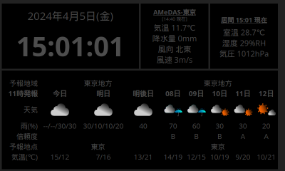

# KIOSK 端末

[Raspberry Pi](Raspberrypi.md) を使った KIOSK 端末

- 時刻表示
- 室内環境 \[温度・湿度・気圧\] 表示を複数個所切替
- 指定地域の AMeDAS データ表示
- 指定市町村の週間天気予報

## 手順
~~~sh
git clone --depth 1 https://github.com/tomosatoP/raspberrypi-kiosk.git
cd raspberrypi-kiosk

# "smashing" を含んだイメージの作成 
docker compose build --pull --no-cache
# "smashing" のプロジェクトを作成
docker compose run --entrypoint "smashing new ." kiosk
docker compose run --entrypoint "bundle" kiosk

# detach モードでサービスを開始
docker compose up -d
~~~

再起動すると、KIOSK端末となる 
表示をカスタマイズしたい場合は、[表示をカスタマイズする際の参考](Customize.md) を参照のこと

## 更新
`Gemfile` を変更した場合など
~~~sh
cd raspberrypi-kiosk
docker compose down --rmi all

docker compose build --pull --no-cache
docker compose run --entrypoint "bundle" kiosk
~~~
